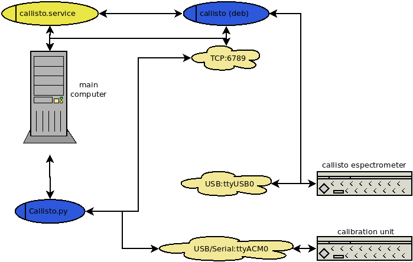

.. Callisto Linux documentation master file

Documentação Callisto Linux!
==========================================

Visão Geral
===========

O espectrômetro Callisto <http://e-callisto.org> é um receptor heteródino de baixo custo, desenvolvido na ETH Zurich em 2006 comvistas ao estudo da atividade solar na frequência de 60 - 860 MHz.

Callisto pode ser acoplado a uma unidade de calibração, com relays controlados por um arduino uno.

A introdução de osciladores pode fazer com que a frequência original de operação do Callisto seja alterada. Para o radiotelescópio BINGO um oscilador LO 1760MHz foi utilizado para obter uma saída `IF = LO - RF` na faixa de 900 a 1700 MHz.

Callisto vem equipado com um programa para o controle do espectrômetro e um programa para controle da unidade de calibração, ambos na forma de binários para windows.

O programa de controle do espectrômetro tem uma versão para sistemas Linux, em particular um pacote `deb` para instalação em instalações da família Debian/Ubuntu/Raspian.

Este pacote fornece operações em uma camada de controle deste binário juntamente com a agregação de controles para a unidade de calibração.

O espectrômetro callisto se conecta a um computador controlador pela USB.

A unidade de calibração é controlada por um arduino que se conecta com um computador controlador pela porta serial ou por meio de um adaptador serial/USB.

O binário `callisto` controla o espectrômetro e interage via protocolo `TCP`.

O programa `callisto.py` controla o binário callisto e a unidade de calibração, por meio dos protocolos serial e tcp.

Um serviço systemd `callisto.service` e trabalhos do crontab automatizam as operações destes dois programas e sua sinergia.

O diagrama geral das relações entre os sistemas é conforme indicado na figura:

Instalação
==========

Uso em linha de comando
=======================

- Calibração em todos os modos (**COLD**, **WARM**, **HOT**), com gravação de spectral overview e de arquivo FIT para cada modo:

.. code-block:: console

     $ python callisto.py

- Parada de qualquer serviço ou programa callisto em funcionamento com cancelamento de gravação de arquivos em andamento:

.. code-block:: console

     $ python callisto.py --action stop
     $ python callisto.py -a stop

- Iniciando servico `systemd`:

.. code-block:: console

     $ python callisto.py --action start-service
     $ python callisto.py -a start-service

- Fazendo uma medição spectral overview:

.. code-block:: console

     $ python callisto.py --action overview --mode HOT
     $ python callisto.py -a overview -m WARM

- Fazendo uma medição FIT:

.. code-block:: console

     $ python callisto.py --action start --mode SKY
     $ python callisto.py -a start -m COLD

Documentação do Módulo
======================

.. automodule:: callisto
    :members:
    :private-members:

Diagrama de Relações Entre Métodos e Classes
============================================

Descrição dos Arquivos
======================

Indices and tables
==================

* :ref:`genindex`
* :ref:`modindex`
* :ref:`search`
