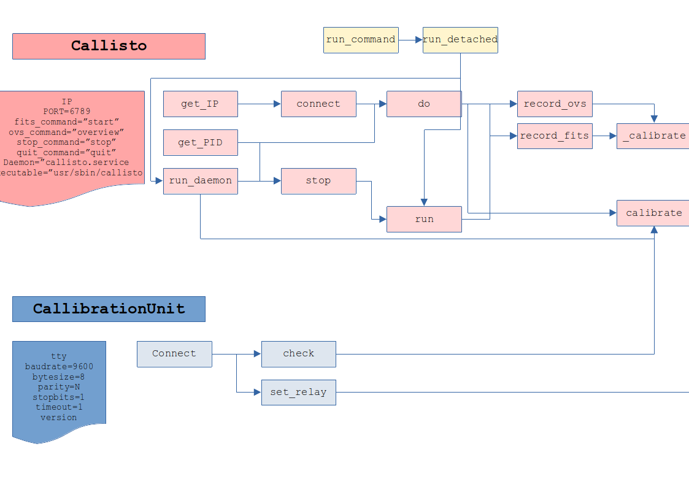

.. Callisto Linux documentation master file

Documentação Callisto Linux!
==========================================

Visão Geral
===========

O espectrômetro Callisto <http://e-callisto.org> é um receptor heteródino de baixo custo, desenvolvido na ETH Zurich em 2006 comvistas ao estudo da atividade solar na frequência de 60 - 860 MHz.

Callisto pode ser acoplado a uma unidade de calibração, com relays controlados por um arduino uno.

A introdução de osciladores pode fazer com que a frequência original de operação do Callisto seja alterada. Para o radiotelescópio BINGO um oscilador LO 1760MHz foi utilizado para obter uma saída `IF = LO - RF` na faixa de 900 a 1700 MHz.

Callisto vem equipado com um programa para o controle do espectrômetro e um programa para controle da unidade de calibração, ambos na forma de binários para windows.

O programa de controle do espectrômetro tem uma versão para sistemas Linux, em particular um pacote `deb` para instalação em instalações da família Debian/Ubuntu/Raspian.

Este pacote fornece operações em uma camada de controle deste binário juntamente com a agregação de controles para a unidade de calibração.

O espectrômetro callisto se conecta a um computador controlador pela USB.

A unidade de calibração é controlada por um arduino que se conecta com um computador controlador pela porta serial ou por meio de um adaptador serial/USB.

O binário `callisto` controla o espectrômetro e interage via protocolo `TCP`.

O programa `callisto.py` controla o binário callisto e a unidade de calibração, por meio dos protocolos serial e tcp.

Um serviço systemd `callisto.service` e trabalhos do crontab automatizam as operações destes dois programas e sua sinergia.

O diagrama geral das relações entre os sistemas é conforme indicado na figura:

.. image:: ./callisto_diagram.png
  :width: 800
  :alt: Diagrama de Relações

Instalação
==========

Verifique previamente os endereços das portas USB do callisto e da unidade de calibração. Em sistemas Linux, usualmente, o arduino se reportará como uma porta `/dev/ttyACM?` e a porta USB do callisto deve ser `/dev/ttyUSB?`. Os padrões dos arquivos de configuração são para as portas com número 0. Se necessário, altere **em todos os arquivos de configuração** `callisto_MODE.cfg` o valor correto para o dispositivo.

É recomendável verificar linha por linha o script de instalação e executar as operações individualmente. Se você estiver superconfiante, faça `sudo ./install.sh`, mas você foi avisado.

.. code-block:: console

     $ git clone https://github.com/lbarosi/callisto.git
     $ cd callisto
     $ sudo python -m pip install -r requirements.txt
     $ # sudo ./install.sh

Uso em linha de comando
=======================

- Calibração em todos os modos (**COLD**, **WARM**, **HOT**), com gravação de spectral overview e de arquivo FIT para cada modo:

.. code-block:: console

     $ python callisto.py

- Parada de qualquer serviço ou programa callisto em funcionamento com cancelamento de gravação de arquivos em andamento:

.. code-block:: console

     $ python callisto.py --action stop
     $ python callisto.py -a stop

- Iniciando servico `systemd`:

.. code-block:: console

     $ python callisto.py --action start-service
     $ python callisto.py -a start-service

- Fazendo uma medição spectral overview:

.. code-block:: console

     $ python callisto.py --action overview --mode HOT
     $ python callisto.py -a overview -m WARM

- Fazendo uma medição FIT:

.. code-block:: console

     $ python callisto.py --action start --mode SKY
     $ python callisto.py -a start -m COLD

Uso
===

1. Crie uma instância de Unidade de Calibraração e uma instância de Callisto para operar, passando a informação da unidade de calibração para a classe callisto.

.. code-block:: python3

     import callisto
     cal_unit = callisto.CalibrationUnit(tty="/dev/ttyACM0")
     Callisto = callisto.Callisto(cal_unit=cal_unit)

2. Fazendo um Spectral Overview:

.. code-block:: python3

     Callisto.record_ovs("COLD")

3. Medição manual FIT:
     Os parâmetros para a medida em um arquivo FIT são definidos no arquivo de configuração que estiver carregado junto ao binário `callisto`. Tipicamente, a medição durará 15 minutos e será realizada em acordo com o arquivo de frequências padrão. Se nada foi alterado, isto significa que serão realizadas medidas em 400 canais, 2 vezes por segundo. Veja a documentação do espectrômetro callisto para mais detalhes.

.. code-block:: python3

     Callisto.record_fits("SKY")

4. Vizualização rápida dos dados:

     1. OVS

     .. code-block:: python3

          import pandas as pd
          import matplotlib.pyplot as plt
          path = "/opt/callisto/Ovs/NOMEDOARQUIVO.prn"
          df = pd.read_table(path, sep=".")
          df.columns = ["Frequency[MHz]", "S[mV]"]
          LO = 1760 #oscilador local para BINGO
          df["Frequency[MHz]"] = LO - df["Frequency[MHz]"]

     .. code-block:: python3

          fig, ax = plt.subplots(figsize = (16,6))
          df.plot("Frequency[MHz]", "S[mV]", ax = ax)
          plt.show();

     2. FIT

     .. code-block:: python3

          import pandas as pd
          from astropy.io import fits
          path = "/opt/callisto/data/NOMEDOARQUIVO.fit"
          hdul = fits_open(path)
          df = pd.DataFrame(hdul)
          fig, ax = plt.subplots(figsize = (16,6))
          plt.imshow(df)
          plt.show();

Documentação do Módulo
======================

.. automodule:: callisto
    :members:
    :private-members:

Diagrama de Relações Entre Métodos e Classes
============================================

Descrição dos Arquivos
======================

Indices and tables
==================

* :ref:`genindex`
* :ref:`modindex`
* :ref:`search`
