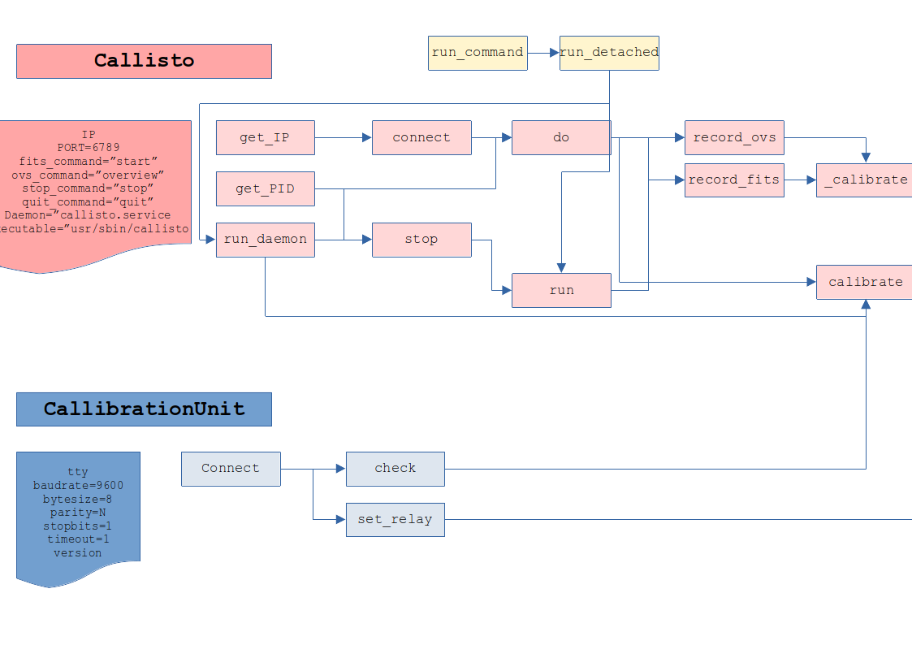

# Running Callisto Spectrometer in Linux

Callisto spectrometer has packages to run with major linux distributions, including raspian. Nevertheless, Linux distribution lacks some important functionalities which are important to controll calibration unit.

Since the callibration unit is controlled by an ARDUINO UNO whose serial port is available to external communication, it is possible to combine the funcionalities of the command line utility with some funcionalities to control the serial port.

The instalation script `install.sh` should be run as privileged user or you may take a look into it and adapt to your needs. **Remember that it is safer to use a privileged user outside a script.**

The basic procedure is:
- Create user and set permissions to use the serial port and appropriate folders.
- Create a directory structure with configuration files in `/etc`
- Install callisto as a system service.
- Install a python script that will handle the serial port communication and some manual tweaking to change focus code.
- Install service as a cron job.

In order to the python script to be able to control the daemon, there must be a configuration in sudoers to allow access to the script.

## Folder Structure:

- `\etc\callisto`: Configuration folder.
     - `callisto.cfg`: configuration file for normal daemon operation with focus code `59` (SKY operation)
     - `callisto_COLD.cfg`: configuration file for manual operation with focus code `01` (COLD operation)
     - `callisto_WARM.cfg`: configuration file for manual operation with focus code `02` (WARM operation)
     - `callisto_HOT.cfg`: configuration file for manual operation with focus code `03` (HOT operation)
- `\opt\callisto`: folder for data and logging.
     - `data`:stores `fit` files.
     - `\ovs`: stores spectral overview files.
     - `\LC`: stores Light Curve files.
     - `log`: stores logging and error from different callisto scripts.

- `\etc\systemd\system\`: stores de service daemon `callisto.service`
- `\usr\sbin`: folder stores `callisto` binary file.
- `\usr\local\bin`: folder stores executable python script `callisto.py` that controls callibration.

## Note

The file `callisto.py` is a python module implementing two classes (`Callisto` and `CalibrationUnit`) and they offer a great deal of control and possibility to customize every parameters.

## Design principles:

- It ts possible to start and stop the callisto binary program as a service daemon.
- It is possible to connect to a running callisto via TCP and perform operations (start, stop, ovs, quit).
- Calibration Unit is controlled via serial connection by sending specific arduino controlls.
- The atomic concect is of a single callisto run with definite focus code and relay switch mode and this can be performed programaticaly any number of time of can be daemonized.

## Relations in Callisto.Py

     
